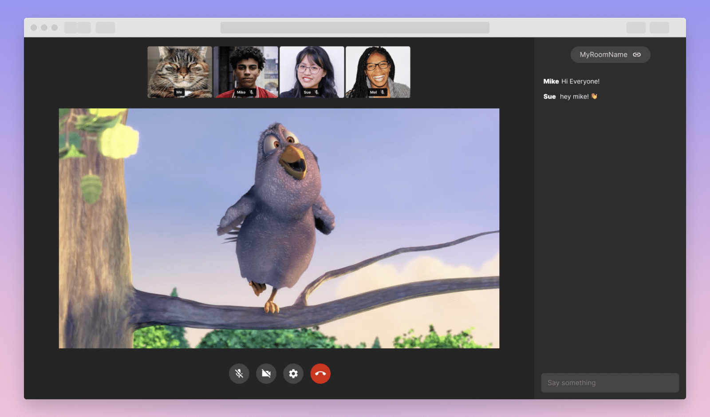

# Amazon IVS + Chime demo

A demo web application intended as an educational tool for demonstrating how to load and play Amazon IVS streams alongside the Amazon Chime SDK.

**This project is intended for education purposes only and not for production usage.**

This is a serverless web application, leveraging [Amazon IVS](https://aws.amazon.com/ivs/), [AWS Lambda](https://aws.amazon.com/lambda/), [API Gateway](https://aws.amazon.com/api-gateway/) and [ChimeSDK](https://aws.amazon.com/chime/chime-sdk). The web user interface is a [single page application](https://en.wikipedia.org/wiki/Single-page_application) built using [responsive web design](https://en.wikipedia.org/wiki/Responsive_web_design) frameworks and techniques, producing a native app-like experience tailored to the user's device.
The demo showcase how customers can use Chime SDK to implement a real-time room with audio and video capabilities where users can watch IVS Stream and chat. Users can enter their name, a room name, and a Playback URL to create a room.
Once in the room, they can share room's unique URL, which can be used by others to join said room. Settings modal shows user their Playback URL, they can change their active audio input/output device and video input device.
There are controls to manage audio, video, a row of cams, a chat, and an option to leave the room.

## Getting Started

***IMPORTANT NOTE:** Deploying this demo application in your AWS account will create and consume AWS resources, which will cost money.*

To get the demo running in your own AWS account, follow these instructions.

1. If you do not have an AWS account, please see [How do I create and activate a new Amazon Web Services account?](https://aws.amazon.com/premiumsupport/knowledge-center/create-and-activate-aws-account/)
2. Log into the [AWS console](https://console.aws.amazon.com/) if you are not already. Note: If you are logged in as an IAM user, ensure your account has permissions to create and manage the necessary resources and components for this application.
3. Complete the instructions for deploying for demo or learning below.

### Deploying for Demo or Learning

If you are interested in running IVS + Chime demo services locally as part of learning, we have [detailed instructions](./serverless) on how to get up and going quickly.

## Documentation
* [Amazon IVS Amazon Interactive Video Service](https://aws.amazon.com/ivs/) is a managed live streaming solution that is quick and easy to set up, and ideal for creating interactive video experiences.\
  Simply send your live streams to Amazon IVS and the service does everything you need to make ultra-low latency live video available to any viewer around the world, letting you focus on building \
  interactive experiences alongside the live video. [Learn more](https://aws.amazon.com/ivs/).
* [Amazon IVS docs](https://docs.aws.amazon.com/ivs/)
* [User Guide](https://docs.aws.amazon.com/ivs/latest/userguide/)
* [API Reference](https://docs.aws.amazon.com/ivs/latest/APIReference/)
* [Learn more about Amazon IVS on IVS.rocks](https://ivs.rocks/)
* [View more demos like this](https://ivs.rocks/examples)

## Known Issues
* The application was written for demonstration purposes and not for production use.
* Currently only tested in the us-west-2 (Oregon) region. Additional regions may be supported depending on service availability.

## License
This sample code is made available under a modified MIT license. See the LICENSE file.
